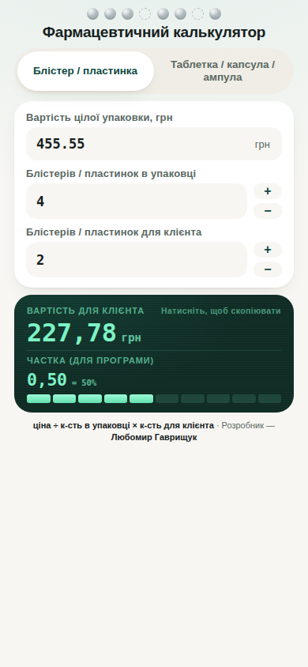

# 💊 Фармацевтичний калькулятор

Простий вебзастосунок для швидкого розрахунку вартості частини упаковки — блістера, пластинки, таблетки, капсули чи ампули — коли клієнт хоче купити не всю упаковку, а лише її частину.

Працює у браузері, встановлюється на телефон як звичайний застосунок (Android/iOS/десктоп) і не потребує інтернету після першого відкриття.



## Можливості

- Розрахунок у реальному часі — без кнопки "порахувати", результат оновлюється одразу під час вводу
- Два режими: **Блістер / пластинка** та **Таблетка / капсула / ампула** — кожен пам'ятає свої останні значення
- Показує одразу два числа: вартість для клієнта (грн) і частку від упаковки (у сотих, наприклад `0,55`)
- Копіювання результату в буфер обміну одним дотиком
- Адаптивний дизайн — однаково добре виглядає на телефоні, планшеті й комп'ютері
- Встановлюється на головний екран телефону (Android і iOS) і працює офлайн
- Жодних сторонніх сервісів, реклами чи збору даних — усі розрахунки відбуваються локально, на пристрої користувача

## Формула розрахунку

```
Вартість для клієнта = (Ціна упаковки ÷ Кількість в упаковці) × Кількість для клієнта
Частка (для програми) = Кількість для клієнта ÷ Кількість в упаковці
```

## Встановлення на телефон

**Android (Chrome):** відкрити посилання → меню (⋮) → «Додати на головний екран» / «Встановити застосунок»

**iOS (Safari):** відкрити посилання → кнопка «Поділитися» → «На екран Home»

## Технології

Один файл `index.html` — чистий HTML, CSS та JavaScript, без збірки, без залежностей і фреймворків. Просто відкрийте файл у браузері або розмістіть на будь-якому статичному хостингу (наприклад, GitHub Pages).

## Ліцензія

Проєкт поширюється за ліцензією **MIT** — див. файл [LICENSE](LICENSE). Це означає, що його можна вільно використовувати, копіювати, змінювати й поширювати, зокрема й для комерційних цілей, за умови збереження посилання на авторство.

## Автор

**Любомир Гаврищук**
